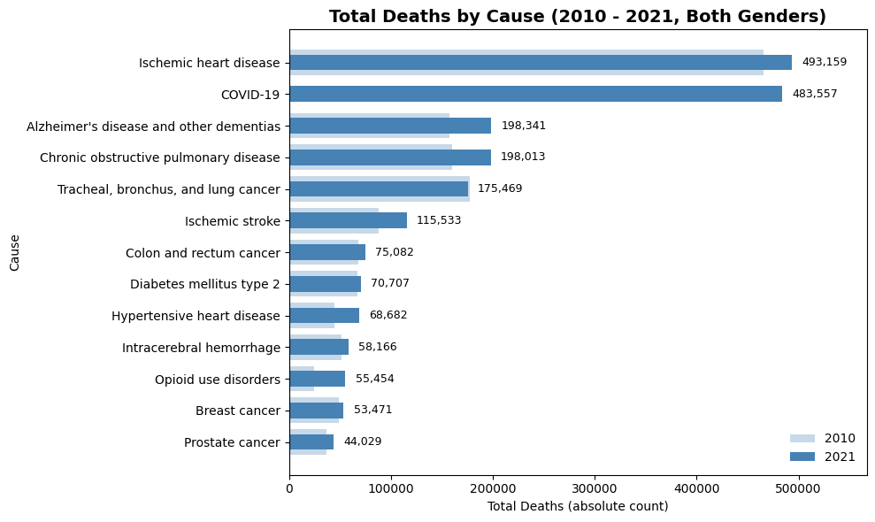
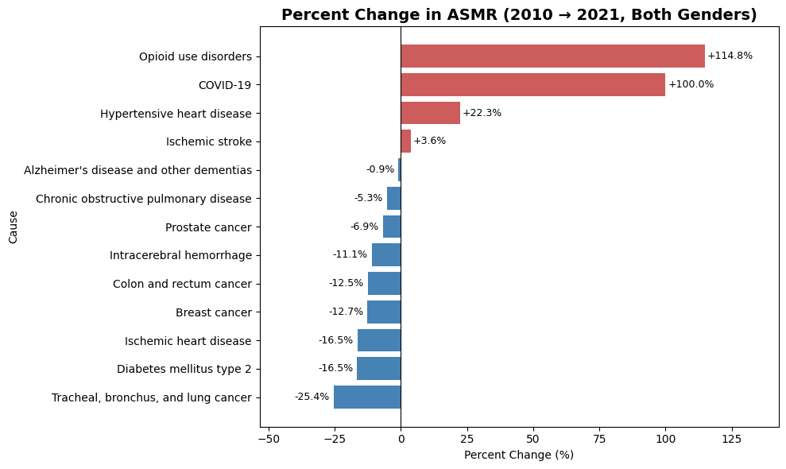
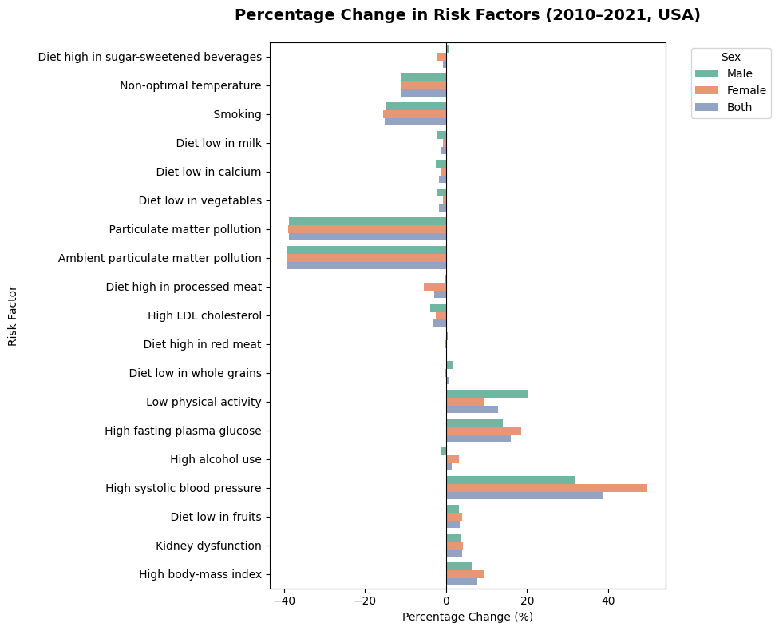

# Tracking U.S. Mortality (2010–2021): Causes, Risks, and Policy Insights. 

This report highlights U.S findings from the Global Burden of Disease 2021 study (GBD 2021) dataset, focusing on understanding current mortality rates, cause-specific mortality, and associated risk factors for men and women across all ages.

If you're not from a healthcare background, start with -> [How To Read This Report](#how-to-read-this-report)

[View Portfolio](https://tony-gh123.github.io/yeral.github.io/)  
[View Project](https://tony-gh123.github.io/Tracking-US-Mortality-2010-2021/)

_By Antony Guillen Hernandez._  
_Date Published: September 15, 2025._

## Executive Summary

### Leading Causes of Mortality in the U.S. and Trends (2010-2021)

- Ischemic heart disease: 493,159 deaths (ASMR: 78.9), down 16.5%.

- COVID-19: 483,557 deaths (ASMR: 86.1), new.

- Alzheimer’s disease and other dementias: 198,341 deaths (ASMR: 29.2), down 0.9%.

- Chronic obstructive pulmonary disease (COPD): 198,013 deaths (ASMR: 31.3), down 5.3%.

- Tracheal, bronchus, and lung cancer: 175,469 deaths (ASMR: 28.9), down 25.4%.

- Ischemic stroke: 115,534 deaths (ASMR: 17.3), up 3.6%.

- Colon and rectum cancer: 75,082 deaths (ASMR: 12.8), down 12.5%.

- Diabetes mellitus type 2: 70,708 deaths (ASMR: 11.8), down 16.5%.

- Hypertensive heart disease: 68,682 deaths (ASMR: 11.4), up 22.3%.

- Intracerebral hemorrhage: 58,167 deaths (ASMR: 9.7), down 11.1%.

- Opioid use disorders: 55,454 deaths (ASMR: 15.4), up 114.8%.

- Breast cancer: 53,471 deaths (ASMR: 9.4), down 12.7%.

- Prostate cancer: 44,029 deaths (ASMR: 6.9), down 6.9%.

 

 

 

### Risk Factor Trends (2010–2021):

- Improving: Particulate matter pollution (SEV: –39%), smoking (SEV: –15%), LDL cholesterol (SEV: –3%).

- Worsening: High systolic blood pressure (SEV: +39%), high fasting plasma glucose (SEV: +16%), high BMI (SEV: +8%), low physical activity (SEV: +20% in men), kidney dysfunction (SEV: +4%).

### Sex-Specific Insights:

- Men faced higher mortality from lung cancer, prostate cancer and opioid use disorders.
- Women were disproportionately affected by breast cancer, hypertensive heart disease, and Alzheimer’s/dementia.

### What this means for policy & practice

1. Heart disease remains the top killer, while hypertensive heart disease and ischemic stroke are rising. Opioid use disorders have more than doubled in YLL rate (burden). These areas demand urgent attention to prevent further increases.

2. Declines in lung cancer, colorectal cancer, diabetes, and intracerebral hemorrhage show that prevention works. Sustaining anti-smoking efforts, cancer screening programs, and other proven interventions will continue this trend.

3. High blood pressure, high blood sugar, obesity, and low physical activity are all trending upward. These risk factors cut across multiple diseases, amplifying the burden. Addressing them will reduce future deaths.

4. Men face higher mortality from prostate cancer and opioid use disorders, while women are disproportionately affected by breast cancer, hypertensive heart disease, and dementia. Policies should reflect these sex-specific differences to be most effective.

 

# United States Burden of Disease

This report highlights U.S findings from the Global Burden of Disease 2021 study (GBD 2021) dataset, focusing on understanding current mortality rates, cause-specific mortality, and associated risk factors for men and women across all ages.

## **Table of Contents**

- [How To Read This Report](#how-to-read-this-report)
- [US Cause-Specific Mortality 2010–2021](#us-cause-specific-mortality-2010–2021)
- [Sex Differences in Mortality](#sex-differences-in-mortality)
- [Disease Profiles & Risk Attribution](#disease-profiles--risk-attribution)
  - [Cardiovascular diseases](#cardiovascular-diseases)
    - [Ischemic heart disease](#ischemic-heart-disease)
    - [Ischemic stroke](#ischemic-stroke)
    - [Hypertensive heart disease](#hypertensive-heart-disease)
    - [Intracerebral hemorrhage](#intracerebral-hemorrhage)
  - [Infectious diseases](#infectious-diseases)
    - [COVID-19](#covid-19)
  - [Neurodegenerative diseases](#neurodegenerative-diseases)
    - [Alzheimer’s disease and other dementias](#alzheimer’s-disease-and-other-dementias)
  - [Chronic respiratory diseases](#chronic-respiratory-diseases)
    - [Chronic obstructive pulmonary disease (COPD)](#chronic-obstructive-pulmonary-disease-copd)
  - [Cancers](#cancers)
    - [Tracheal, bronchus, and lung cancer](#tracheal-bronchus-and-lung-cancer)
    - [Colon and rectum cancer](#colon-and-rectum-cancer)
    - [Prostate cancer](#prostate-cancer)
    - [Breast cancer](#breast-cancer)
  - [Metabolic diseases](#metabolic-diseases)
    - [Diabetes mellitus type 2](#diabetes-mellitus-type-2)
  - [Substance use disorders](#substance-use-disorders)
    - [Opioid use disorders](#opioid-use-disorders)
- [Risk Exposure Trends](#risk-exposure-trends-sev-percent-change)
- [Citations](#citations)

## How To Read This Report

**Data Source**: Global Burden of Disease (GBD 2021) US estimates, 2010–2021.

**Metrics**: 

- **ASMR (Age-Standardized Mortality Rate)**: Deaths per 100k people, adjusted for age. 
   _Example: Comparing 2010 vs 2021 heart disease risk without being skewed by an older population._

- **Total Deaths**: The raw number of people who died. _Useful for planning hospital beds, workforce, budgets._

- **YLLs (Years of Life Lost)**: Total years of life cut short by early death. _Example: If someone dies at 50 instead of 80, that’s 30 YLLs._ 

- **YLL rate**: YLLs per 100k, age-adjusted. _Helps compare premature death burden across time and groups._

- **DALYs (Disability-Adjusted Life Years)**: YLLs + years lived with disability. _Captures both early death and time spent in poor health._

- **SEV (Summary Exposure Value)**: How much of the population is exposed to a risk × how strong that risk is. Reported as % change between 2010–2021.

**95% UIs**: Estimates include a 95% uncertainty intervals (UIs). _Example: Ischemic heart disease 2021 ASMR = 78.91, but the 95% uncertainty range is (69.67–83.78)._

**PAF Tables**: _Population Attributable Fractions_ (PAFs) represent the proportion of disease burden that could be prevented if specific risk exposures were eliminated. PAFs are model-based and generally do not sum to 100% of disease burden.

**PAF Rating Reference Table**

| Risk-Outcome Score (ROS) | Star Rating | Interpretation |
|---------------------------|-------------|----------------|
| ≤ 0                      | 1           | No or very weak evidence  |
| 0 – 0.14                 | 2           | Weak evidence (up to 15% ) |
| 0.14 – 0.41              | 3           | Moderate evidence (15–50% increase) |
| 0.41 – 0.62              | 4           | Strong evidence (50–85% increase) |
| > 0.62                   | 5           | Very strong evidence (>85% increase) |

[18] _Table Extract_

## US Cause-Specific Mortality 2010–2021

Key Highlights: 

- Ischemic heart disease: 493,159 deaths (ASMR: 78.9), down 16.5%.

- COVID-19: 483,557 deaths (ASMR: 86.1), new.

- Alzheimer’s disease and other dementias: 198,341 deaths (ASMR: 29.2), down 0.9%.

- Chronic obstructive pulmonary disease (COPD): 198,013 deaths (ASMR: 31.3), down 5.3%.

- Tracheal, bronchus, and lung cancer: 175,469 deaths (ASMR: 28.9), down 25.4%.

- Ischemic stroke: 115,534 deaths (ASMR: 17.3), up 3.6%.

- Colon and rectum cancer: 75,082 deaths (ASMR: 12.8), down 12.5%.

- Diabetes mellitus type 2: 70,708 deaths (ASMR: 11.8), down 16.5%.

- Hypertensive heart disease: 68,682 deaths (ASMR: 11.4), up 22.3%.

- Intracerebral hemorrhage: 58,167 deaths (ASMR: 9.7), down 11.1%.

- Opioid use disorders: 55,454 deaths (ASMR: 15.4), up 114.8%.

- Breast cancer: 53,471 deaths (ASMR: 9.4), down 12.7%.

- Prostate cancer: 44,029 deaths (ASMR: 6.9), down 6.9%.

| cause                                   | 2010 (ASMR)          | 2021 (ASMR)         | total_deaths_2021            | total_deaths_2010            | Type                        |   Rank |
|:----------------------------------------|:---------------------|:--------------------|:-----------------------------|:-----------------------------|:----------------------------|-------:|
| Ischemic heart disease                  | 94.47 (83.20-100.09) | 78.91 (69.67-83.78) | 493159.3 (429792.2-526475.9) | 465668.8 (403900.5-496118.9) | Cardiovascular disease      |      1 |
| COVID-19                                | 0.00 (0.00-0.00)     | 86.13 (84.42-87.86) | 483557.0 (474047.7-493138.1) | 0.0 (0.0-0.0)                | Infectious disease          |      2 |
| Alzheimer's disease and other dementias | 29.49 (7.47-74.34)   | 29.22 (7.43-73.30)  | 198341.2 (50556.0-496323.7)  | 157783.0 (39943.7-395503.3)  | Neurodegenerative disease   |      3 |
| Chronic obstructive pulmonary disease   | 33.07 (29.33-34.85)  | 31.31 (27.65-33.18) | 198013.3 (173659.8-210420.3) | 160177.8 (140567.6-169550.5) | Chronic respiratory disease |      4 |
| Tracheal, bronchus, and lung cancer     | 38.80 (36.02-40.31)  | 28.94 (26.55-30.40) | 175469.3 (159995.5-184719.0) | 177100.5 (163380.3-184527.1) | Cancer                      |      5 |
| Ischemic stroke                         | 16.72 (13.80-18.23)  | 17.33 (14.24-18.93) | 115533.7 (94307.1-126700.0)  | 88498.7 (72345.1-96860.7)    | Cardiovascular disease      |      6 |
| Colon and rectum cancer                 | 14.62 (13.32-15.37)  | 12.79 (11.66-13.51) | 75082.2 (67503.9-79684.8)    | 68271.4 (61467.6-72075.5)    | Cancer                      |      7 |
| Diabetes mellitus type 2                | 14.15 (12.86-14.89)  | 11.81 (10.75-12.49) | 70707.6 (63673.6-74999.5)    | 66941.9 (60132.4-70738.1)    | Metabolic disease           |      8 |
| Hypertensive heart disease              | 9.29 (8.26-9.80)     | 11.36 (9.85-12.64)  | 68682.2 (58474.5-76752.8)    | 44540.9 (38959.0-47305.9)    | Cardiovascular disease      |      9 |
| Intracerebral hemorrhage                | 10.90 (9.82-11.48)   | 9.69 (8.73-10.25)   | 58166.7 (51856.8-61719.0)    | 51183.7 (45422.2-54168.1)    | Cardiovascular disease      |     10 |
| Opioid use disorders                    | 7.16 (6.84-7.51)     | 15.38 (13.63-17.30) | 55454.0 (48758.5-62835.3)    | 24445.8 (23346.0-25598.4)    | Substance use disorder      |     11 |
| Breast cancer                           | 10.78 (9.76-11.29)   | 9.41 (8.53-9.94)    | 53471.4 (47803.3-56779.9)    | 48952.1 (43822.2-51538.5)    | Cancer                      |     12 |
| Prostate cancer                         | 7.42 (6.75-7.77)     | 6.91 (6.21-7.32)    | 44029.0 (39312.3-46747.1)    | 36514.7 (32885.0-38332.1)    | Cancer                      |     13 |

_Data extract filtered for United States, 2010–2021 (Global Burden of Disease Collaborative Network, 2024). Derived Type & Rank features_

## Sex Differences in Mortality

- Males in the US share the same leading causes as females, but rankings differ. We observe that Lung Cancers has increased in ranking, and that Prostate Cancer & Opioid Use Disorder makes it to this list.

- Among females, Alzheimer’s disease ranks in the top three alongside ischemic heart disease and COVID-19. This pattern is consistent with sex and age-structure differences in dementia incidence and survival. Hypertensive heart disease also appears in the female top 10. 

 

 

  
<strong>View Male Mortality Rate Table</strong>

| cause                                   | 2010 (ASMR)            | 2021 (ASMR)            | total_deaths_2021            | Type                        |   Rank |
|:----------------------------------------|:-----------------------|:-----------------------|:-----------------------------|:----------------------------|-------:|
| Ischemic heart disease                  | 125.80 (114.53-131.07) | 108.09 (98.27-113.55)  | 281430.9 (256579.6-295340.8) | Cardiovascular disease      |      1 |
| COVID-19                                | 0.00 (0.00-0.00)       | 111.95 (109.74-114.21) | 271851.9 (266506.3-277321.7) | Infectious disease          |      2 |
| Tracheal, bronchus, and lung cancer     | 48.68 (45.75-50.44)    | 34.77 (32.48-36.35)    | 94731.5 (88596.5-98908.0)    | Cancer                      |      3 |
| Chronic obstructive pulmonary disease   | 38.02 (34.61-39.71)    | 34.59 (31.53-36.30)    | 93157.7 (85247.4-97580.7)    | Chronic respiratory disease |      4 |
| Alzheimer's disease and other dementias | 25.65 (6.29-66.71)     | 25.64 (6.32-66.08)     | 65646.9 (16224.5-170705.7)   | Neurodegenerative disease   |      5 |
| Prostate cancer                         | 18.68 (16.77-19.64)    | 16.47 (14.62-17.53)    | 44029.0 (39312.3-46747.1)    | Cancer                      |      6 |
| Ischemic stroke                         | 15.54 (13.52-16.55)    | 16.77 (14.60-17.94)    | 43513.1 (38055.3-46497.3)    | Cardiovascular disease      |      7 |
| Diabetes mellitus type 2                | 17.01 (15.79-17.73)    | 15.14 (14.02-15.90)    | 39860.2 (37009.7-41828.2)    | Metabolic disease           |      8 |
| Colon and rectum cancer                 | 17.46 (16.29-18.19)    | 15.16 (14.13-15.91)    | 39375.2 (36650.6-41300.7)    | Cancer                      |      9 |
| Opioid use disorders                    | 9.28 (8.81-9.79)       | 21.06 (18.84-23.70)    | 37238.4 (33078.6-42161.5)    | Substance use disorder      |     10 |

_Data extract filtered for United States (Male), 2010–2021 (Global Burden of Disease Collaborative Network, 2024). Derived Type & Rank features_

  
<strong>View Female Mortality Rate Table</strong>

| cause                                   | 2010 (ASMR)         | 2021 (ASMR)         | total_deaths_2021            | Type                        |   Rank |
|:----------------------------------------|:--------------------|:--------------------|:-----------------------------|:----------------------------|-------:|
| Ischemic heart disease                  | 69.97 (58.69-75.78) | 55.29 (46.28-60.03) | 211728.4 (171773.1-232530.3) | Cardiovascular disease      |      1 |
| COVID-19                                | 0.00 (0.00-0.00)    | 63.36 (62.10-64.62) | 211705.0 (207577.3-215911.7) | Infectious disease          |      2 |
| Alzheimer's disease and other dementias | 31.85 (8.17-79.44)  | 31.65 (8.16-78.43)  | 132694.3 (34331.5-325656.2)  | Neurodegenerative disease   |      3 |
| Chronic obstructive pulmonary disease   | 29.87 (25.86-31.83) | 28.95 (24.72-31.01) | 104855.6 (88270.9-113104.8)  | Chronic respiratory disease |      4 |
| Tracheal, bronchus, and lung cancer     | 31.10 (28.32-32.66) | 24.22 (21.57-25.66) | 80737.8 (71254.3-85998.3)    | Cancer                      |      5 |
| Ischemic stroke                         | 17.06 (13.67-18.83) | 17.35 (13.69-19.23) | 72020.6 (56014.6-80386.6)    | Cardiovascular disease      |      6 |
| Breast cancer                           | 19.43 (17.77-20.30) | 17.17 (15.66-18.09) | 52868.1 (47230.3-56148.3)    | Cancer                      |      7 |
| Hypertensive heart disease              | 7.95 (6.75-8.56)    | 9.94 (8.24-10.88)   | 37272.1 (29699.2-41374.3)    | Cardiovascular disease      |      8 |
| Colon and rectum cancer                 | 12.30 (10.89-13.08) | 10.74 (9.48-11.48)  | 35707.1 (30800.8-38470.3)    | Cancer                      |      9 |
| Diabetes mellitus type 2                | 11.84 (10.41-12.61) | 9.01 (7.92-9.65)    | 30847.5 (26494.5-33330.8)    | Metabolic disease           |     10 |

_Data extract filtered for United States (FEMALE), 2010–2021 (Global Burden of Disease Collaborative Network, 2024). Derived Type & Rank features_

 

# Disease Profiles & Risk Attribution

Within each of the cause-specific mortality outlined above, there are multivariate reasons as to how they develop, their associated risk exposures, and what we can do to mitigate them. In the following section I uniquely identified each of these diseases, provided a summary from the National Library of Medicine, identified their risk factors and quantified relevant public health metrics.

## Cardiovascular diseases

### **Ischemic heart disease**

  
View Medical Definition

[3]
_Ischemia is defined as inadequate blood supply (circulation) to a local area due to blockage of the blood vessels supplying the area. Ischemic means that an organ (e.g., the heart) is not getting enough blood and oxygen. Ischemic heart disease, also called coronary heart disease (CHD) or coronary artery disease, is the term given to heart problems caused by narrowed heart (coronary) arteries that supply blood to the heart muscle._

&nbsp;

Ischemic heart disease (IHD), also called coronary artery disease, is the leading cause of death in the United States and worldwide. It arises when narrowed coronary arteries restrict blood flow to the heart muscle, depriving it of oxygen. The condition can remain silent for years but often culminates in heart attacks or chronic heart failure, making it one of the most devastating and costly public health challenges. While prevention and treatment have improved survival over the past decades, the burden remains immense due to the sheer scale of the disease and the prevalence of its risk factors. Between 2010 and 2021, the age-standardized YLL rate fell from 1,749 → 1,490 per 100k (−15%).

So what’s driving IHD? 

- High systolic blood pressure (94k DALYs in 2021, very strong evidence). 
- Kidney dysfunction (26k DALYS, strong evidence)
- high LDL cholesterol (66k DALYS, moderate evidence)

Lifestyle factors like smoking, low physical activity, and diets low in whole grains remain meaningful contributors. 

| Risk Name                    | Outcome Name            |   Risk-Outcome Score |   Star Rating | 2021 DALYS (in thousands)   | Risk Type                   |
|:-----------------------------|:------------------------|---------------------:|--------------:|:----------------------------|:----------------------------|
| High systolic blood pressure | Ischaemic heart disease |                 0.7  |             5 | 94000 (75600 to 111000)     | Metabolic                   |
| Kidney dysfunction           | Ischaemic heart disease |                 0.45 |             4 | 26100 (18900 to 33400)      | Metabolic                   |
| High LDL cholesterol         | Ischaemic heart disease |                 0.32 |             3 | 66700 (47500 to 87000)      | Metabolic                   |
| Particulate matter pollution | Ischaemic heart disease |                 0.26 |             3 | 54700 (41700 to 67400)      | Environmental/ Occupational |
| Smoking                      | Ischaemic heart disease |                 0.19 |             3 | 35500 (30500 to 40700)      | Behavioural                 |
| Low physical activity        | Ischaemic heart disease |                 0.18 |             3 | 3900 (1770 to 6120)         | Behavioural                 |
| Diet low in whole grains     | Ischaemic heart disease |                 0.17 |             3 | 27100 (16900 to 36700)      | Behavioural                 |
| High fasting plasma glucose  | Ischaemic heart disease |                 0.15 |             3 | 25900 (22300 to 29800)      | Metabolic                   |

The Global Burden of Disease model estimates that 90% of IHD DALYs in 2021 could be explained by known, preventable risks. That’s both alarming and empowering, it means the disease that kills more Americans than anything else is largely within our control. 

  
<strong>View YLL Table</strong>

| location_name            | cause_name             | 2010 (Age-Standardised Rate - YLLs)   | 2021 (Age-Standardised Rate - YLLs)   | 2010 (All-Age YLLs)             | 2021 (All-Age YLLs)             |
|:-------------------------|:-----------------------|:--------------------------------------|:--------------------------------------|:--------------------------------|:--------------------------------|
| United States of America | Ischemic heart disease | 1748.70 (1615.75-1813.47)             | 1489.59 (1375.69-1555.73)             | 8016850.2 (7326438.9-8353224.0) | 8529036.5 (7800011.7-8941669.1) |

  
<strong>View PAF Table</strong>

| Cause                  | Location   | Deaths          | DALYs           | YLDs            | YLLs            |
|                        |            | 2021            | 2021            | 2021            | 2021            |
|:-----------------------|:-----------|:----------------|:----------------|:----------------|:----------------|
| Ischemic heart disease | USA        | 88·8            | 89·9            | 88·4            | 89·9            |
|                        |            | (82·3  –  93·0) | (83·7  –  93·7) | (81·4  –  92·8) | (83·7  –  93·7) |

 

---

### **Ischemic stroke**

  
View Medical Definition

[4]
_Strokes are classified as ischemic or hemorrhagic, with hemorrhagic strokes further divided into intracerebral and subarachnoid hemorrhages. Among ischemic strokes, the Trial of Org 10172 in Acute Stroke Treatment (TOAST) classification system is commonly used to categorize subtypes, which include: Cardioembolism, Small vessel occlusion, Large artery atherosclerosis, Stroke of undetermined etiology, Stroke of other determined etiology._

&nbsp;

Stroke is the fifth leading cause of death in the US, and ischemic strokes, caused by blocked blood flow to the brain, make up the vast majority of cases. Unlike ischemic heart disease, which has been trending downward, stroke has quietly inched upward. Between 2010 and 2021, the age-standardized YLL rate increased from 216 → 231 per 100k (+7%).

So what’s behind the increase? GBD highlights a mix of metabolic and behavioral drivers:

- High LDL cholesterol (21k DALYs, moderate evidence)
- High fasting plasma glucose (12k DALYs, moderate evidence)
- Low physical activity and diets low in fruits/vegetables (together 6k DALYs, moderate evidence)

| Risk Name                   | Outcome Name     |   Risk-Outcome Score |   Star Rating | 2021 DALYS (in thousands)   | Risk Type   |
|:----------------------------|:-----------------|---------------------:|--------------:|:----------------------------|:------------|
| High LDL cholesterol        | Ischaemic stroke |                 0.2  |             3 | 21000 (7410 to 34700)       | Metabolic   |
| Low physical activity       | Ischaemic stroke |                 0.15 |             3 | 3360 (907 to 6300)          | Behavioural |
| Diet low in vegetables      | Ischaemic stroke |                 0.15 |             3 | 1190  (636 to 1830)         | Behavioural |
| High fasting plasma glucose | Ischaemic stroke |                 0.15 |             3 | 12400  (9590 to 15400)      | Metabolic   |
| Diet low in fruits          | Ischaemic stroke |                 0.15 |             3 | 2060  (1090 to 3270)        | Behavioural |

The GBD model estimates that over three-quarters of ischemic stroke burden (78%) can be explained by these preventable risks.

  
<strong>View YLL Table</strong>

| location_name            | cause_name      | 2010 (Age-Standardised Rate - YLLs)   | 2021 (Age-Standardised Rate - YLLs)   | 2010 (All-Age YLLs)            | 2021 (All-Age YLLs)             |
|:-------------------------|:----------------|:--------------------------------------|:--------------------------------------|:-------------------------------|:--------------------------------|
| United States of America | Ischemic stroke | 215.56 (184.19-231.31)                | 231.19 (199.80-248.27)                | 1082047.9 (914693.8-1167597.3) | 1466656.5 (1250827.2-1582356.5) |

  
<strong>View PAF Table</strong>

| Cause   | Location   | Deaths 2021     | DALYs 2021      | YLDs 2021       | YLLs 2021       | 
|:--------|:-----------|:----------------|:----------------|:----------------|:----------------|
| Stroke  | USA        | 77·5            | 76·8            | 79·1            | 76·2            |
|         |            | (69·0  –  84·8) | (68·3  –  83·8) | (70·9  –  85·6) | (67·2  –  83·4) |

 

---

### **Hypertensive heart disease**

  
View Medical Definition

[5]
_Hypertensive heart disease (HHD) refers to a constellation of structural and functional changes in the left ventricle, left atrium, and coronary arteries resulting from chronic blood pressure elevation. Hypertension increases myocardial workload, leading to compensatory remodeling, most notably left ventricular hypertrophy (LVH), which may progress to heart failure._

&nbsp;

Hypertensive heart disease (HHD) develops as a long-term complication of chronic high blood pressure. Unlike ischemic heart disease, which results from blocked coronary arteries, HHD stems from the heart’s constant struggle against elevated pressure, leading to structural remodeling, thickened walls, and eventual heart failure. From 2010 to 2021, the age-standardized YLL rate rose from 208 -> 245 per 100k (+18%). 

The GBD framework does not currently attribute HHD to specific risk factors beyond elevated blood pressure itself. One modeled factor, non-optimal temperature, shows only weak evidence.

| Risk Name               | Outcome Name               |   Risk-Outcome Score |   Star Rating | 2021 DALYS (in thousands)   | Risk Type                   |
|:------------------------|:---------------------------|---------------------:|--------------:|:----------------------------|:----------------------------|
| Non-optimal temperature | Hypertensive heart disease |                 0.05 |             2 | 1700 (1250 to 2200)         | Environmental/ Occupational |

The absence of many listed “risks” here doesn’t mean the disease is mysterious. GBD models treat high blood pressure as a cause for HHD rather than a risk input; that’s why few risk factors appear in the HHD table.

  
<strong>View YLL Table</strong>

| location_name            | cause_name                 | 2010 (Age-Standardised Rate - YLLs)   | 2021 (Age-Standardised Rate - YLLs)   | 2010 (All-Age YLLs)          | 2021 (All-Age YLLs)             |
|:-------------------------|:---------------------------|:--------------------------------------|:--------------------------------------|:-----------------------------|:--------------------------------|
| United States of America | Hypertensive heart disease | 208.01 (196.37-214.21)                | 244.89 (220.05-269.74)                | 906563.8 (845942.4-937504.3) | 1292198.1 (1150279.1-1430773.9) |

 

---

### **Intracerebral hemorrhage**

  
View Medical Definition

[6]
_Intracerebral hemorrhage (ICH), a subtype of stroke, is a devastating condition whereby a hematoma is formed within the brain parenchyma with or without blood extension into the ventricles._

&nbsp;

Intracerebral hemorrhage (ICH), bleeding directly into the brain tissue, is one of the most lethal forms of stroke, often leaving little time for effective intervention. Outcomes for ICH are generally poorer, making prevention the critical line of defense. From 2010 to 2021, the age-standardized YLL rate declined from 235 -> 210 per 100k (−11%).

When it comes to risk factors, the evidence is weak. GBD identifies several contributors with only low to weak evidence, including:

- High alcohol use (4.6k DALYs, weak evidence)
- High fasting plasma glucose (4.1k DALYs, weak evidence)
- Diets low in fruits/vegetables/fiber (collectively weak evidence)
- High body-mass index (weak evidence)

| Risk Name                   | Outcome Name              |   Risk-Outcome Score |   Star Rating | 2021 DALYS (in thousands)   | Risk Type   |
|:----------------------------|:--------------------------|---------------------:|--------------:|:----------------------------|:------------|
| High alcohol use            | Intracerebral haemorrhage |                 0.05 |             2 | 4570 (136 to 9390)          | Behavioural |
| High fasting plasma glucose | Intracerebral haemorrhage |                 0.05 |             2 | 4100 (2160 to 6090)         | Metabolic   |
| Diet low in fruits          | Intracerebral haemorrhage |                 0.03 |             2 | 6590 (-493 to 12300)        | Behavioural |
| Diet low in vegetables      | Intracerebral haemorrhage |                 0.02 |             2 | 1190 (-129 to 2250)         | Behavioural |
| High body-mass index        | Intracerebral haemorrhage |                 0.02 |             2 | 2720 (6.44 to 6340)         | Metabolic   |
| Diet low in fibre           | Intracerebral haemorrhage |                 0    |             1 | 2700 (-776 to 5610)         | Behavioural |
| Diet high in red meat       | Intracerebral haemorrhage |                -0.13 |             1 | -4520 (-18800 to 6290)      | Behavioural |

Interestingly, some modeled associations, like diet high in red meat, show no or even negative effect, underscoring the uncertainty in current epidemiological evidence for ICH. No PAF table is available, reflecting this lack of strong, consistent risk attribution.

  
<strong>View YLL Table</strong>

| location_name            | cause_name               | 2010 (Age-Standardised Rate - YLLs)   | 2021 (Age-Standardised Rate - YLLs)   | 2010 (All-Age YLLs)            | 2021 (All-Age YLLs)             |
|:-------------------------|:-------------------------|:--------------------------------------|:--------------------------------------|:-------------------------------|:--------------------------------|
| United States of America | Intracerebral hemorrhage | 234.99 (221.28-243.57)                | 210.09 (196.19-220.27)                | 1028031.1 (959408.6-1068850.1) | 1145736.6 (1058507.9-1203160.4) |

 

## Infectious diseases

### **COVID-19**

[7] Coronavirus disease (COVID-19) is an infectious disease caused by the SARS-CoV-2 virus. Most people infected with the virus will experience mild to moderate respiratory illness and recover without requiring special treatment. However, some will become seriously ill and require medical attention. Older people and those with underlying medical conditions like cardiovascular disease, diabetes, chronic respiratory disease, or cancer are more likely to develop serious illness. Anyone can get sick with COVID-19 and become seriously ill or die at any age.

  
<strong>View YLL Table</strong>

| location_name            | cause_name   | 2010 (Age-Standardised Rate - YLLs)   | 2021 (Age-Standardised Rate - YLLs)   | 2010 (All-Age YLLs)   | 2021 (All-Age YLLs)                |
|:-------------------------|:-------------|:--------------------------------------|:--------------------------------------|:----------------------|:-----------------------------------|
| United States of America | COVID-19     | 0.00 (0.00-0.00)                      | 2254.69 (2209.34-2301.50)             | 0.0 (0.0-0.0)         | 10728179.2 (10514594.1-10947546.0) | 

 
 
## Neurodegenerative diseases

### **Alzheimer’s disease and other dementias**

  
View Medical Definition

[8]
_Dementia is a general term used to describe a significant decline in cognitive ability that interferes with a person's activities of daily living. Alzheimer disease (AD) is the most prevalent type of dementia, accounting for at least two-thirds of cases in individuals aged 65 and older. AD is a neurodegenerative condition with insidious onset and progressive impairment of behavioral and cognitive functions. These functions include memory, comprehension, language, attention, reasoning, and judgment. While AD does not directly cause death, it substantially raises vulnerability to other complications, which can eventually lead to a person's death._

&nbsp;

Alzheimer’s disease and related dementias are not sudden killers like stroke or heart attack, they are slow, progressive conditions that erode memory, judgment, and independence over years. While dementia itself rarely appears as the “immediate cause” of death, it greatly increases vulnerability to infections, falls, and other complications that ultimately shorten life.

In 2021, dementia accounted for an age-standardized YLL rate of 356 per 100k, unchanged since 2010 (−1%). Absolute years of life lost increased by 27%, from 1.85M -> 2.34M. This rise is driven almost entirely by population aging, as more Americans live longer, more enter the age brackets where dementia is common. For women, who generally outlive men, dementia ranks even higher among causes of death.

When it comes to causes, science is still catching up. The GBD framework shows only weak evidence for known risks:

- Smoking (1.5k DALYs, weak evidence)
- High fasting plasma glucose (5.3k DALYs, weak evidence)
- High BMI (no effect)

| Risk Name                   | Outcome Name                            |   Risk-Outcome Score |   Star Rating | 2021 DALYS (in thousands)   | Risk Type   |
|:----------------------------|:----------------------------------------|---------------------:|--------------:|:----------------------------|:------------|
| Smoking                     | Alzheimer's disease and other dementias |                 0.09 |             2 | 1530                        | Behavioural |
|                             |                                         |                      |               | (663 to 3500)               |             |
| High fasting plasma glucose | Alzheimer's disease and other dementias |                 0.04 |             2 | 5350 (308 to 14400)         | Metabolic   |
| High body-mass index        | Alzheimer's disease and other dementias |                -0.07 |             1 | 2670 (-494 to 9330)         | Metabolic   |

In other words, unlike heart disease or stroke, dementia doesn’t yet have clear, modifiable population-level levers in the same way. Instead, what we see is a complex interplay of age, genetics, cardiovascular health, and lifestyle.

  
<strong>View YLL Table</strong>

| location_name            | cause_name                              | 2010 (Age-Standardised Rate - YLLs)   | 2021 (Age-Standardised Rate - YLLs)   | 2010 (All-Age YLLs)            | 2021 (All-Age YLLs)            |
|:-------------------------|:----------------------------------------|:--------------------------------------|:--------------------------------------|:-------------------------------|:-------------------------------|
| United States of America | Alzheimer's disease and other dementias | 359.81 (90.90-928.73)                 | 356.17 (90.09-912.58)                 | 1847416.5 (466450.5-4736423.8) | 2344030.4 (594648.7-5992541.2) |

 

## Chronic respiratory diseases

### **Chronic obstructive pulmonary disease (COPD)**

  
View Medical Definition

[9]
_Chronic obstructive pulmonary disease (COPD) is a common and treatable disease characterized by progressive airflow limitation and tissue destruction. It is associated with structural lung changes due to chronic inflammation from prolonged exposure to noxious particles or gases most commonly cigarette smoke. Chronic inflammation causes airway narrowing and decreased lung recoil. The disease often presents with symptoms of cough, dyspnea, and sputum production. Symptoms can range from being asymptomatic to respiratory failure._

&nbsp;

Chronic obstructive pulmonary disease (COPD) is often called a “smoker’s disease,” but it’s more accurately the long-term scarring of the lungs from years of exposure to cigarettes, polluted air, and other noxious particles. Once damage accumulates, it limits airflow permanently, leaving many patients struggling with breathlessness, recurrent infections, and in severe cases, respiratory failure. From 2010 to 2021, the age-standardized YLL rate fell from 584 → 551 per 100k (−6%).

The risk profile for COPD is clear:

- Smoking (27.8k DALYs in 2021; strong evidence)
- Particulate matter pollution (33.2k DALYs; strong evidence)

| Risk Name                    | Outcome Name                          |   Risk-Outcome Score |   Star Rating | 2021 DALYS (in thousands)   | Risk Type                   |
|:-----------------------------|:--------------------------------------|---------------------:|--------------:|:----------------------------|:----------------------------|
| Smoking                      | Chronic obstructive pulmonary disease |                 0.54 |             4 | 27800 (22200 to 32900)                       | Behavioural                 |
| Particulate matter pollution | Chronic obstructive pulmonary disease |                 0.44 |             4 | 33200 (26700 to 41300)                       | Environmental/ Occupational |

Together, these exposures explain more than half of COPD deaths and DALYs in the US. That makes COPD one of the most preventable major killers, as in theory, if smoking were eliminated and air quality were improved, the majority of cases could be avoided.

  
<strong>View YLL Table</strong>

| location_name            | cause_name                            | 2010 (Age-Standardised Rate - YLLs)   | 2021 (Age-Standardised Rate - YLLs)   | 2010 (All-Age YLLs)             | 2021 (All-Age YLLs)             |
|:-------------------------|:--------------------------------------|:--------------------------------------|:--------------------------------------|:--------------------------------|:--------------------------------|
| United States of America | Chronic obstructive pulmonary disease | 583.79 (535.32-606.72)                | 551.42 (503.63-575.88)                | 2690832.1 (2451891.5-2807272.5) | 3342893.7 (3032731.2-3500188.2) |

  
<strong>View PAF Table</strong>

| Cause                                 | Location   | Deaths 2021     | DALYs 2021      | YLDs 2021       | YLLs 2021       |
|:--------------------------------------|:-----------|:----------------|:----------------|:----------------|:----------------|
| Chronic obstructive pulmonary disease | USA        | 55·4            | 55·8            | 49·1            | 58·4            |
|                                       |            | (47·1  –  63·0) | (47·4  –  63·6) | (39·7  –  57·9) | (50·3  –  66·1) |

  

## Cancers

### **Tracheal, Bronchus, and Lung Cancer**

  
View Medical Definition

[10]
_Initially described in 1785 by Sandifort, the tracheal bronchus is a rare congenital anomaly in which an accessory bronchus originates directly from the trachea, usually directed toward the upper lobe of the lung. This condition is more common on the right side and is typically discovered incidentally during imaging or bronchoscopy for other reasons._

[11]
_Lung cancer or bronchogenic carcinoma refers to tumors originating in the lung parenchyma or within the bronchi. It is interesting to note that lung cancer was a relatively rare disease at the beginning of the 20th century. Its dramatic rise in later decades is mostly attributable to the increase in smoking among both males and females._ 

&nbsp;

Tracheal, Bronchus, and Lung Cancer remains one of the most lethal cancer groups in the United States, historically driven by widespread tobacco use in the 20th century. Today, it continues to be a leading cause of cancer death, though recent decades have seen encouraging declines. Advances in tobacco control, cleaner air standards, and early detection have shifted trends, reducing both risk and mortality. Despite this progress, the disease still imposes a heavy burden, largely tied to modifiable risk factors like smoking and air pollution. From 2010 to 2021, the age-standardized YLL rate dropped from 865 → 620 per 100k (−28%).

The drivers are clear and well-documented:

- Smoking (27.7k DALYs, very strong evidence)
- Particulate matter pollution (8.9k DALYs, moderate evidence)
- Diets low in fruits (1.6k DALYs, moderate evidence)

| Risk Name                    | Outcome Name                        |   Risk-Outcome Score |   Star Rating | 2021 DALYS (in thousands)   | Risk Type                   |
|:-----------------------------|:------------------------------------|---------------------:|--------------:|:----------------------------|:----------------------------|
| Smoking                      | Tracheal, bronchus, and lung cancer |                 0.73 |             5 | 27700 (24400 to 31600)      | Behavioural                 |
| Particulate matter pollution | Tracheal, bronchus, and lung cancer |                 0.34 |             3 | 8930 (5680 to 12400)        | Environmental/ Occupational |
| Diet low in fruits           | Tracheal, bronchus, and lung cancer |                 0.19 |             3 | 1610 (828 to 2350)          | Behavioural                 |

Together, these exposures account for nearly three-quarters of the US lung cancer burden in 2021. The fact that smoking is by far the dominant risk, with an estimated 85% increase in likelihood, underscores the extraordinary impact of decades-long anti-tobacco campaigns. Clean air initiatives have also played a supporting role.

  
<strong>View YLL Table</strong>

| location_name            | cause_name                          | 2010 (Age-Standardised Rate - YLLs)   | 2021 (Age-Standardised Rate - YLLs)   | 2010 (All-Age YLLs)             | 2021 (All-Age YLLs)             |
|:-------------------------|:------------------------------------|:--------------------------------------|:--------------------------------------|:--------------------------------|:--------------------------------|
| United States of America | Tracheal, bronchus, and lung cancer | 864.86 (819.87-891.74)                | 620.33 (583.81-646.11)                | 3823614.3 (3610197.4-3948014.5) | 3590279.0 (3358656.2-3744333.9) |

  
<strong>View PAF Table</strong>

| Cause                               | Location   | Deaths 2021     | DALYs 2021      | YLDs 2021       | YLLs 2021       |
|:------------------------------------|:-----------|:----------------|:----------------|:----------------|:----------------|
| Tracheal, bronchus, and lung cancer | USA        | 72·5            | 73·8            | 73·1            | 73·8            |
|                                     |            | (67·3  –  77·1) | (68·5  –  78·0) | (67·8  –  77·6) | (68·5  –  78·0) |

 

---

### **Colon and rectum cancer**

  
View Medical Definition

[12]
_Most colon cancer is sporadic, and approximately 5 percent are due to an inherited genetic mutation, mostly due to Lynch syndrome (hereditary nonpolyposis colon cancer or HNPCC) and familial adenomatous polyposis (FAP). The transition from normal colon epithelium to invasive cancer takes several years and most commonly follows a sequence characterized by the accumulation of genetic mutations, adenoma formation, and subsequent carcinogenesis (adenoma-carcinoma sequence). (NLM (12)). Colon and rectal cancers (CRC) combined are the third most commonly diagnosed cancer in the United States and the second deadliest. Rectal cancer has distinct environmental associations and genetic risk factors different from colon cancer.The transformation of the normal rectal epithelium to a dysplastic lesion and eventually an invasive carcinoma requires a combination of genetic mutations, either somatic (acquired) or germline (inherited), over an approximately 10 to 15 year period. Response to pre-operative therapy and pathological staging are the most important prognostic indicators of rectal cancer._

&nbsp;

Colon and rectum cancer (CRC) is the third most commonly diagnosed cancer in the United States and the second leading cause of cancer death. Most cases develop sporadically over a decade or more, through the gradual progression from benign polyps to invasive cancer, though a small fraction arise from inherited syndromes such as Lynch syndrome or familial adenomatous polyposis. Because the disease develops slowly, timely screening and early removal of precancerous lesions are key to reducing mortality. From 2010 to 2021, the age-standardized YLL rate fell from 327 → 295 per 100k (−10%), suggesting progress in screening and treatment.

Key drivers are linked to diet and lifestyle:

- Diet low in calcium (2.1k DALYs, moderate evidence)
- Low physical activity (1.3k DALYs, moderate evidence)
- Diets low in fiber, whole grains, and milk (weak evidence)
- High BMI and fasting glucose (weak evidence)
- Diets high in red and processed meat (weak evidence)

| Risk Name                   | Outcome Name            |   Risk-Outcome Score |   Star Rating | 2021 DALYS (in thousands)   | Risk Type   |
|:----------------------------|:------------------------|---------------------:|--------------:|:----------------------------|:------------|
| Diet low in calcium         | Colon and rectum cancer |                 0.35 |             3 | 2130 (1570 to 2670)         | Behavioural |
| Low physical activity       | Colon and rectum cancer |                 0.19 |             3 | 1330 (831 to 1830)          | Behavioural |
| Diet low in fibre           | Colon and rectum cancer |                 0.12 |             2 | 306 (135 to 470)            | Behavioural |
| High body-mass index        | Colon and rectum cancer |                 0.09 |             2 | 2360 (1020 to 3750)         | Metabolic   |
| Diet low in whole grains    | Colon and rectum cancer |                 0.07 |             2 | 4330 (1750 to 6580)         | Behavioural |
| High fasting plasma glucose | Colon and rectum cancer |                 0.07 |             2 | 1750 (901 to 2660)          | Metabolic   |
| Diet low in milk            | Colon and rectum cancer |                 0.06 |             2 | 3710 (1010 to 6140)         | Behavioural |
| Diet high in red meat       | Colon and rectum cancer |                 0.06 |             2 | 3550 (-1.3 to 7210)         | Behavioural |
| Diet high in processed meat | Colon and rectum cancer |                 0    |             2 | 1300 (-310 to 2660)         | Behavioural |

Altogether, these exposures explain about 62% of the US CRC burden. 

  
<strong>View YLL Table</strong>

| location_name            | cause_name              | 2010 (Age-Standardised Rate - YLLs)   | 2021 (Age-Standardised Rate - YLLs)   | 2010 (All-Age YLLs)             | 2021 (All-Age YLLs)             |
|:-------------------------|:------------------------|:--------------------------------------|:--------------------------------------|:--------------------------------|:--------------------------------|
| United States of America | Colon and rectum cancer | 327.08 (308.40-339.01)                | 294.72 (277.84-306.77)                | 1436571.3 (1346741.0-1492807.5) | 1577371.3 (1476145.3-1647316.5) |

  
<strong>View PAF Table</strong>

| Cause                   | Location   | Deaths 2021     | DALYs 2021      | YLDs 2021       | YLLs 2021       |
|:------------------------|:-----------|:----------------|:----------------|:----------------|:----------------|
| Colon and rectum cancer | USA        | 62·4            | 62·6            | 62·6            | 62·6            |
|                         |            | (40·9  –  77·7) | (40·9  –  78·0) | (41·0  –  78·5) | (40·9  –  78·0) |

 

---

### **Prostate cancer**

  
View Medical Definition

[13]
_Prostate cancer is an adenocarcinoma as it develops primarily from the glandular part of the organ and shows typical glandular patterns on microscopic examination. The cancer cells grow and multiply, initially spreading to the surrounding prostate tissue, forming a tumor nodule. Such a tumor may grow outside the prostate (extracapsular extension) or may remain localized within the prostate for decades. Prostate cancer commonly metastasizes to the bones and lymph nodes. Metastases to the bone are believed to be partially due to the prostatic venous plexus draining into the vertebral veins._

&nbsp;

Prostate cancer is one of the most common cancers affecting men worldwide and a leading cause of cancer-related death in the United States. While it often remains localized and slow-growing for many years, advanced cases can metastasize, particularly to the bones and lymph nodes, leading to significant health burden. Despite its prevalence, the precise risk factors behind prostate cancer are not fully understood, which complicates prevention strategies. From 2010 to 2021, the age-standardized YLL rate fell from 123 → 114 per 100k (−7%), suggesting progress in screening and treatment.

Unfortunately the risk factors associated with Prostate Cancer are yet not fully understood, therefore we have limited information. 

| Risk Name           | Outcome Name    |   Risk-Outcome Score |   Star Rating | 2021 DALYS (in thousands)   | Risk Type   |
|:--------------------|:----------------|---------------------:|--------------:|:----------------------------|:------------|
| Diet low in calcium | Prostate cancer |                    0 |             2 | -97.5 (-211 to 18.4)        | Behavioural |

  
<strong>View YLL Table</strong>

| location_name            | cause_name      | 2010 (Age-Standardised Rate - YLLs)   | 2021 (Age-Standardised Rate - YLLs)   | 2010 (All-Age YLLs)          | 2021 (All-Age YLLs)          |
|:-------------------------|:----------------|:--------------------------------------|:--------------------------------------|:-----------------------------|:-----------------------------|
| United States of America | Prostate cancer | 123.15 (114.66-127.72)                | 114.10 (105.39-119.80)                | 577888.8 (534445.9-600848.8) | 705513.7 (647686.6-741476.0) |

 

---

### **Breast cancer**

  
View Medical Definition

[14]
_Most breast cancer is sporadic (90%-95%), with only 5% to 10% of patients having an identifiable genetic mutation. BRCA 1 and 2 are the most common associated genetic conditions. Invasive ductal and invasive lobular carcinoma are the most common pathologic forms of invasive breast cancer. Carcinogenesis occurs due to a complex interplay of genetic and environmental risk factors, hormonal influences, and patient-related factors._

&nbsp;

Breast cancer is the most frequently diagnosed cancer among women in the US and remains a leading cause of cancer death worldwide. While 5–10% of cases can be traced to inherited mutations, the vast majority (90–95%) are sporadic, shaped by a complex interplay of hormones, environment, and lifestyle. From 2010 to 2021, the age-standardized YLL rate declined from 276 → 239 per 100k (−13%), showing progress in early detection and treatment.

Unfortunately, breast cancer lacks clear, dominant risk factors. The evidence is relatively weak and diffused:

- Smoking (310 DALYs, weak evidence)
- Diet high in red meat (2.5k DALYs, weak evidence)
- Low physical activity (415 DALYs, weak evidence)

| Risk Name             | Outcome Name   |   Risk-Outcome Score |   Star Rating | 2021 DALYS (in thousands)   | Risk Type   |
|:----------------------|:---------------|---------------------:|--------------:|:----------------------------|:------------|
| Smoking               | Breast cancer  |                 0.04 |             2 | 310 (237 to 389)            | Behavioural |
| Diet high in red meat | Breast cancer  |                 0.03 |             2 | 2450 (-0.791 to 5230)       | Behavioural |
| Low physical activity | Breast cancer  |                 0.01 |             2 | 415 (83.3 to 729)           | Behavioural |

Overall, the GBD model suggests that only about one-third (35%) of the US breast cancer burden can currently be attributed to known risk factors. The rest reflects unmeasured influences, from reproductive history and hormonal exposures to gene–environment interactions that are still poorly understood.

  
<strong>View YLL Table</strong>

| location_name            | cause_name    | 2010 (Age-Standardised Rate - YLLs)   | 2021 (Age-Standardised Rate - YLLs)   | 2010 (All-Age YLLs)             | 2021 (All-Age YLLs)             |
|:-------------------------|:--------------|:--------------------------------------|:--------------------------------------|:--------------------------------|:--------------------------------|
| United States of America | Breast cancer | 275.71 (260.97-284.50)                | 238.59 (225.02-248.84)                | 1178488.2 (1107445.5-1219563.6) | 1218273.0 (1136493.4-1273985.1) |

  
<strong>View PAF Table</strong>

| Cause         | Location   | Deaths 2021     | DALYs 2021      | YLDs 2021       | YLLs 2021       |
|:--------------|:-----------|:----------------|:----------------|:----------------|:----------------|
| Breast cancer | USA        | 35·8            | 35·1            | 35·5            | 35·0            |
|               |            | (13·2  –  52·9) | (14·0  –  51·4) | (13·9  –  51·8) | (14·0  –  51·3) |

 

## Metabolic diseases

### **Diabetes mellitus type 2**

  
View Medical Definition

[15]
_Diabetes mellitus (DM) is a chronic metabolic disorder characterized by persistent hyperglycemia. It may be due to impaired insulin secretion, resistance to peripheral actions of insulin, or both. Chronic hyperglycemia in synergy with the other metabolic aberrations in patients with diabetes mellitus can cause damage to various organ systems, leading to the development of disabling and life-threatening health complications, most prominent of which are microvascular (retinopathy, nephropathy, and neuropathy) and macrovascular complications leading to a 2-fold to 4-fold increased risk of cardiovascular diseases._

&nbsp;

Type 2 diabetes is the quintessential lifestyle-driven chronic disease. It develops when the body can no longer use insulin effectively, leading to persistent high blood sugar that silently damages blood vessels, kidneys, eyes, and nerves. Beyond its direct complications, diabetes multiplies the risk of cardiovascular disease, making it one of the most important drivers of premature mortality in the US. From 2010 to 2021, the age-standardized YLL rate fell from 298 → 259 per 100k (−13%), reflecting progress in diagnosis, treatment, and awareness.

The drivers of Type 2 diabetes are unusually well defined:

- High body-mass index (39k DALYS, strong evidence).
- Particulate matter pollution and smoking (moderate evidence)

Behavioral risks; smoking, low physical activity, diets low in fiber/whole grains, and consumption of processed meats and sugary drinks collectively account for tens of thousands of DALYs.

| Risk Name                              | Outcome Name             |   Risk-Outcome Score |   Star Rating | 2021 DALYS (in thousands)   | Risk Type                   |
|:---------------------------------------|:-------------------------|---------------------:|--------------:|:----------------------------|:----------------------------|
| High body-mass index                   | Diabetes mellitus type 2 |                 0.49 |             4 | 39300 (19100 to 56400)     | Metabolic                            |
| Particulate matter pollution           | Diabetes mellitus type 2 |                 0.19 |             3 | 12900 (7500 to 19500)      | Environmental/ Occupational |
| Smoking                                | Diabetes mellitus type 2 |                 0.15 |             3 | 5470 (4280 to 7060)        | Behavioural                 |
| Low physical activity                  | Diabetes mellitus type 2 |                 0.14 |             2 | 5520 (2410 to 8640)        | Behavioural                 |
| Diet low in fibre                      | Diabetes mellitus type 2 |                 0.12 |             2 | 775 (427 to 1160)          | Behavioural                 |
| Diet low in whole grains               | Diabetes mellitus type 2 |                 0.09 |             2 | 5080 (1500 to 8540)        | Behavioural                 |
| Diet high in sugar-sweetened beverages | Diabetes mellitus type 2 |                 0.08 |             2 | 3030 (1520 to 4590)        | Behavioural                 |
| Diet high in processed meat            | Diabetes mellitus type 2 |                 0.08 |             2 | 6100 (1480 to 10400)       | Behavioural                 |
| High alcohol use                       | Diabetes mellitus type 2 |                 0.04 |             2 | 1360 (338 to 2840)         | Behavioural                 |
| Diet low in fruits                     | Diabetes mellitus type 2 |                 0.03 |             2 | 3380 (532 to 6080)         | Behavioural                 |
| Diet high in red meat                  | Diabetes mellitus type 2 |                 0.01 |             2 | 3820 (-585 to 8710)        | Behavioural                 |

Unlike cancers or dementia, where risk attribution is partial or uncertain, diabetes is overwhelmingly preventable through weight management, diet, and physical activity.

  
<strong>View YLL Table</strong>

| location_name            | cause_name                                             | 2010 (Age-Standardised Rate - YLLs)   | 2021 (Age-Standardised Rate - YLLs)   | 2010 (All-Age YLLs)             | 2021 (All-Age YLLs)             |
|:-------------------------|:-------------------------------------------------------|:--------------------------------------|:--------------------------------------|:--------------------------------|:--------------------------------|
| United States of America | Diabetes mellitus type 2                               | 297.85 (280.11-308.92)                | 258.89 (243.65-270.20)                | 1332339.5 (1242931.4-1386105.3) | 1432014.9 (1338349.5-1499140.6) |

 

## Substance use disorders

### **Opioid use disorders**

  
View Medical Definition

[16]
_Opioid use disorder (OUD) is defined as the chronic use of opioids that causes clinically significant distress or impairment. Symptoms of this disease include an overpowering desire to use opioids, increased opioid tolerance, and withdrawal syndrome when opioids are discontinued. Thus, OUD can range from dependence on opioids to addiction._

&nbsp;

Opioid use disorder (OUD) is not driven by diet, blood pressure, or cholesterol, it is a disease of dependency, born from pain management, social vulnerability, and the biology of addiction. OUD blurs the line between medical treatment and illicit use, as patients prescribed opioids for pain can find themselves trapped in cycles of tolerance, craving, and withdrawal. The age-standardized YLL rate more than doubled, from 363 → 772 per 100k (+112%).

For Opioid use disorder, one could attribute lead risk factors as social and environmental as addiction feeds addiction and drugs had to be started to develop addiction. Further roads to addiction are medication (pain killers) and overall mental health scape routes for people. However, there is not an estimated lead factor, as we lack sufficient evidence.

Because these drivers are diffuse and socially embedded, the Global Burden of Disease framework does not assign a clean population attributable fraction (PAF) as it does for smoking or obesity. The crisis is less about biology and more about policy, prescribing practices, and social safety nets.

  
<strong>View YLL Table</strong>

| location_name            | cause_name           | 2010 (Age-Standardised Rate - YLLs)   | 2021 (Age-Standardised Rate - YLLs)   | 2010 (All-Age YLLs)             | 2021 (All-Age YLLs)             |
|:-------------------------|:---------------------|:--------------------------------------|:--------------------------------------|:--------------------------------|:--------------------------------|
| United States of America | Opioid use disorders | 363.48 (347.24-381.49)                | 771.51 (687.87-862.41)                | 1181289.0 (1128237.8-1239064.1) | 2629560.8 (2334086.1-2953650.9) |

 

## Risk Exposure Trends (SEV percent change)

Below is an excerpt outlining the percent change of each risk exposure mentioned as a factor of the diseases studied above and key highlights. 

1. Exposure to particulate matter pollution fell by ~39% for both men and women, showing major progress in air pollution control.
2. Smoking dropped by ~15%, continuing a decades-long downward trend. 
3. Alcohol use stayed roughly the same (slight increase for women, stable for men).
4. Fruit and vegetable intake showed little change, with slight improvement in fruit intake but stagnation in vegetables.
5. Whole grains and dairy (milk) remain low with minimal change.
6. Processed meat consumption decreased modestly (esp. among women), while red meat intake stayed about the same.
7. Sugar-sweetened beverages showed no meaningful decline, remaining a persistent issue.
8. Low physical activity increased (esp. in men, +20%), suggesting sedentary lifestyles remain a growing concern.
9. High body-mass index (BMI) rose by ~8% overall, reinforcing obesity as a worsening driver of chronic disease.
10. High fasting plasma glucose (+16%) and high systolic blood pressure (+39%) saw the sharpest increases, especially among women.
11. High LDL cholesterol improved slightly (–3%), likely reflecting widespread statin use and improved treatment.
12. Kidney dysfunction showed small increases (~4%).

 

  
<strong>View Risk Factors Table</strong>

| Risk Name                              | Percentage change 2010-2021 Male   | Percentage change 2010-2021 Female   | Percentage change 2010-2021 Both   | Location   |
|:---------------------------------------|:-----------------------------------|:-------------------------------------|:-----------------------------------|:-----------|
| Particulate matter pollution           | -38·9 (-55·0  –  -29·4)            | -39·0 (-55·0  –  -29·5)              | -38·9 (-55·0  –  -29·5)            | USA        |
| Ambient particulate matter pollution   | -39·2 (-55·2  –  -29·6)            | -39·2 (-55·2  –  -29·7)              | -39·2 (-55·2  –  -29·6)            | USA        |
| Non-optimal temperature                | -11·1 (-13·0  –  -8·8)             | -11·2 (-13·1  –  -8·9)               | -11·1 (-13·1  –  -8·8)             | USA        |
| Smoking                                | -14·9 (-19·8  –  -9·5)             | -15·6 (-23·4  –  -6·3)               | -15·2 (-19·6  –  -10·2)            | USA        |
| High alcohol use                       | -1·4 (-5·4  –  2·7)                | 3·1 (-2·2  –  8·7)                   | 1·4 (-3·0  –  5·7)                 | USA        |
| Diet low in fruits                     | 3·2 (-5·3  –  11·1)                | 4·0 (-5·0  –  13·2)                  | 3·4 (-2·8  –  9·4)                 | USA        |
| Diet low in vegetables                 | -2·1 (-9·0  –  5·5)                | -0·8 (-9·3  –  8·9)                  | -1·7 (-6·9  –  5·0)                | USA        |
| Diet low in whole grains               | 1·7 (-2·2  –  6·2)                 | -0·3 (-4·6  –  4·1)                  | 0·6 (-2·5  –  3·9)                 | USA        |
| Diet low in milk                       | -2·4 (-18·8  –  14·9)              | -0·8 (-7·3  –  6·1)                  | -1·3 (-7·1  –  5·0)                | USA        |
| Diet high in red meat                  | 0·4 (-7·7  –  160·9)               | -0·1 (-9·1  –  60·9)                 | 0·1 (-5·4  –  28·6)                | USA        |
| Diet high in processed meat            | -0·1 (-7·5  –  7·1)                | -5·5 (-13·1  –  1·4)                 | -3·0 (-7·9  –  2·1)                | USA        |
| Diet high in sugar-sweetened beverages | 0·9 (-11·0  –  13·8)               | -2·1 (-13·3  –  8·9)                 | -0·8 (-9·0  –  8·0)                | USA        |
| Diet low in calcium                    | -2·5 (-5·7  –  1·1)                | -1·3 (-4·3  –  1·8)                  | -1·7 (-4·3  –  1·0)                | USA        |
| Low physical activity                  | 20·4 (-2·4  –  51·2)               | 9·4 (-6·9  –  28·1)                  | 12·8 (-0·8  –  28·4)               | USA        |
| High fasting plasma glucose            | 14·1 (2·4  –  27·6)                | 18·5 (7·5  –  31·1)                  | 16·0 (8·0  –  25·9)                | USA        |
| High LDL cholesterol                   | -4·0 (-7·1  –  -1·2)               | -2·5 (-5·1  –  0·0)                  | -3·3 (-5·1  –  -1·5)               | USA        |
| High systolic blood pressure           | 32·0 (5·6  –  69·8)                | 49·8 (15·1  –  96·4)                 | 38·9 (17·0  –  70·6)               | USA        |
| High body-mass index                   | 6·4 (2·4  –  11·0)                 | 9·2 (4·8  –  13·4)                   | 7·8 (4·4  –  11·1)                 | USA        |
| Kidney dysfunction                     | 3·6 (2·0  –  5·6)                  | 4·2 (2·5  –  6·2)                    | 3·9 (2·4  –  5·5)                  | USA        |

## Citations

1. Global Burden of Disease Collaborative Network. Global Burden of Disease Study 2021 (GBD 2021) **Cause-Specific Mortality 1990-2021**. Seattle, United States of America: Institute for Health Metrics and Evaluation (IHME), 2024.

2. Global Burden of Disease Collaborative Network. Global Burden of Disease Study 2021 (GBD 2021) **Burden-Risk Factors 1990-2021**. Seattle, United States of America: Institute for Health Metrics and Evaluation (IHME), 2024.

3. Institute of Medicine (US) Committee on Social Security Cardiovascular Disability Criteria. Cardiovascular Disability: Updating the Social Security Listings. Washington (DC): National Academies Press (US); 2010. 7, Ischemic Heart Disease. Available from: https://www.ncbi.nlm.nih.gov/books/NBK209964/

4. Lui F, Khan Suheb MZ, Patti L. Ischemic Stroke. [Updated 2025 Feb 21]. In: StatPearls [Internet]. Treasure Island (FL): StatPearls Publishing; 2025 Jan-. Available from: https://www.ncbi.nlm.nih.gov/books/NBK499997/

5. Shams P, Tackling G, Borhade MB. Hypertensive Heart Disease. [Updated 2025 Apr 26]. In: StatPearls [Internet]. Treasure Island (FL): StatPearls Publishing; 2025 Jan-. Available from: https://www.ncbi.nlm.nih.gov/books/NBK539800/

6. Rajashekar D, Liang JW. Intracerebral Hemorrhage. [Updated 2023 Feb 6]. In: StatPearls [Internet]. Treasure Island (FL): StatPearls Publishing; 2025 Jan-. Available from: https://www.ncbi.nlm.nih.gov/books/NBK553103/ 

7. https://www.who.int/health-topics/coronavirus#tab=tab_1 

8. Kumar A, Sidhu J, Lui F, et al. Alzheimer Disease. [Updated 2024 Feb 12]. In: StatPearls [Internet]. Treasure Island (FL): StatPearls Publishing; 2025 Jan-. Available from: https://www.ncbi.nlm.nih.gov/books/NBK499922/ 

9. Agarwal AK, Raja A, Brown BD. Chronic Obstructive Pulmonary Disease. [Updated 2023 Aug 7]. In: StatPearls [Internet]. Treasure Island (FL): StatPearls Publishing; 2025 Jan-. Available from: https://www.ncbi.nlm.nih.gov/books/NBK559281/

10. Winters R, Soos MP. Tracheal Bronchus. [Updated 2025 Jan 19]. In: StatPearls [Internet]. Treasure Island (FL): StatPearls Publishing; 2025 Jan-. Available from: https://www.ncbi.nlm.nih.gov/books/NBK547715/

11. Siddiqui F, Vaqar S, Siddiqui AH. Lung Cancer. [Updated 2023 May 8]. In: StatPearls [Internet]. Treasure Island (FL): StatPearls Publishing; 2025 Jan-. Available from: https://www.ncbi.nlm.nih.gov/books/NBK482357/ 

12. Menon G, Cagir B. Colon Cancer. [Updated 2025 Feb 27]. In: StatPearls [Internet]. Treasure Island (FL): StatPearls Publishing; 2025 Jan-. Available from: https://www.ncbi.nlm.nih.gov/books/NBK470380/

13. Lotfollahzadeh S, Kashyap S, Tsoris A, et al. Rectal Cancer. [Updated 2023 Jul 4]. In: StatPearls [Internet]. Treasure Island (FL): StatPearls Publishing; 2025 Jan-. Available from: https://www.ncbi.nlm.nih.gov/books/NBK493202/

14. Leslie SW, Soon-Sutton TL, Skelton WP. Prostate Cancer. [Updated 2024 Oct 4]. In: StatPearls [Internet]. Treasure Island (FL): StatPearls Publishing; 2025 Jan-. Available from: https://www.ncbi.nlm.nih.gov/books/NBK470550/

15. Menon G, Alkabban FM, Ferguson T. Breast Cancer. [Updated 2024 Feb 25]. In: StatPearls [Internet]. Treasure Island (FL): StatPearls Publishing; 2025 Jan-. Available from: https://www.ncbi.nlm.nih.gov/books/NBK482286/ 

16. Goyal R, Singhal M, Jialal I. Type 2 Diabetes. [Updated 2023 Jun 23]. In: StatPearls [Internet]. Treasure Island (FL): StatPearls Publishing; 2025 Jan-. Available from: https://www.ncbi.nlm.nih.gov/books/NBK513253/

17. Dydyk AM, Jain NK, Gupta M. Opioid Use Disorder: Evaluation and Management. [Updated 2024 Jan 17]. In: StatPearls [Internet]. Treasure Island (FL): StatPearls Publishing; 2025 Jan-. Available from: https://www.ncbi.nlm.nih.gov/books/NBK553166/

18. Zheng, P., Afshin, A., Biryukov, S. et al. The Burden of Proof studies: assessing the evidence of risk. Nat Med 28, 2038–2044 (2022). https://www.nature.com/articles/s41591-022-01973-2#Tab1 
